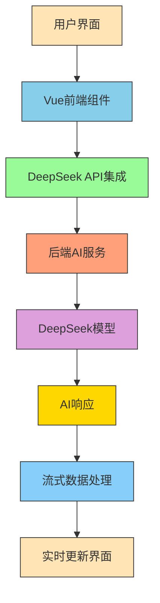
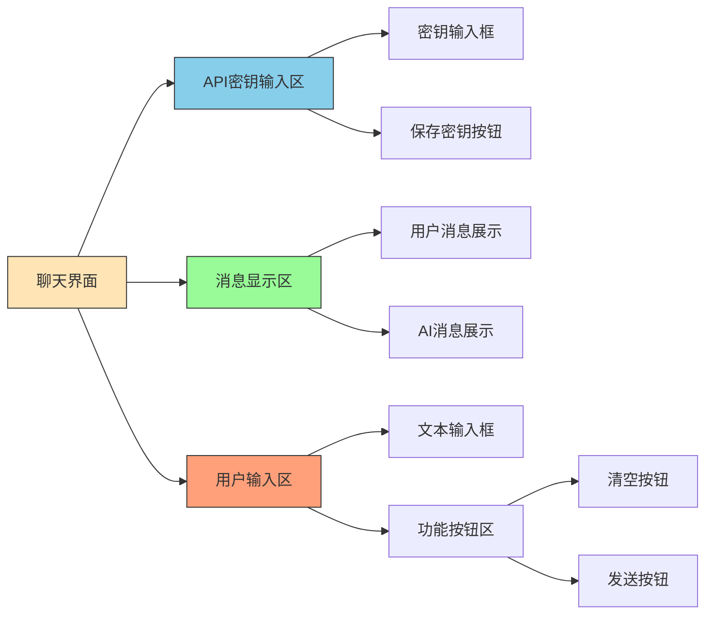
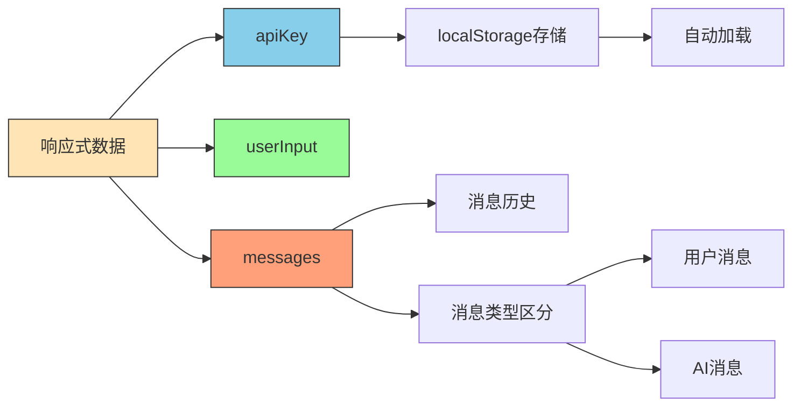
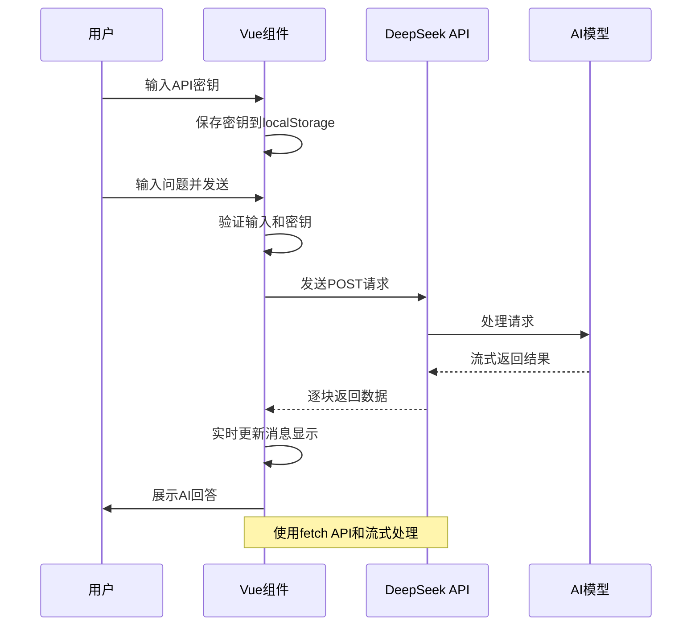
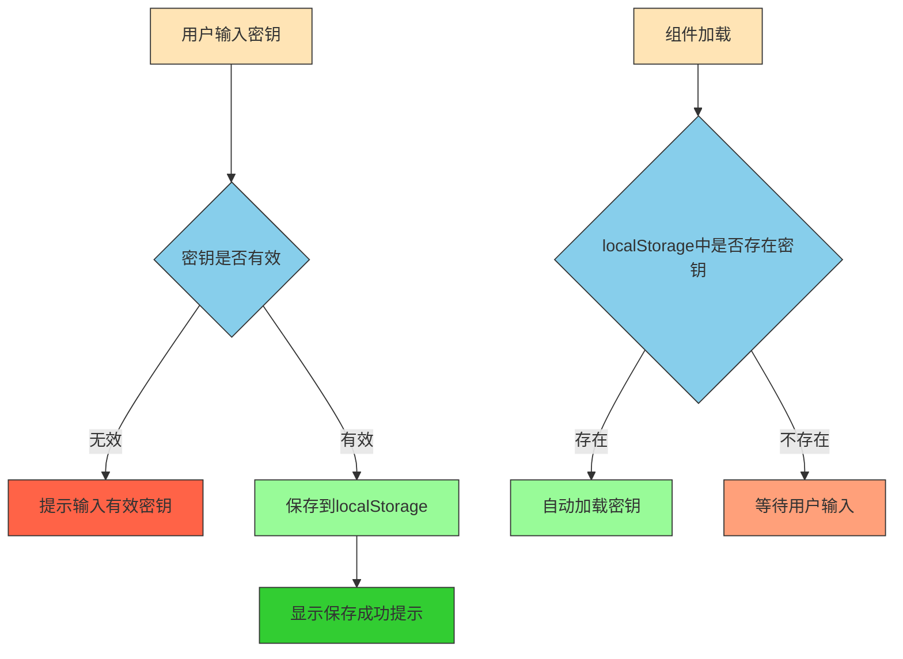
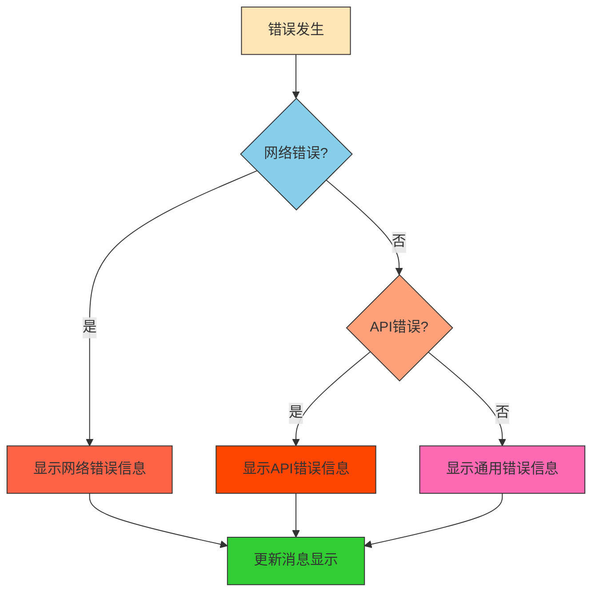

# DeepSeek AI 智能问答功能实现结构图

## 整体架构



## 核心组件详解

### 1. 用户界面层 (UI Layer)



### 2. 数据管理层 (Data Management)



### 3. 核心功能流程 (Core Function Flow)



## 详细实现逻辑

### 1. API密钥管理流程



### 2. 消息处理流程

```mermaid
graph TD
    A[用户发送消息] --> B{输入验证}
    B -- 失败 --> C[提示错误]
    B -- 成功 --> D[添加用户消息到历史]
    D --> E[清空输入框]
    E --> F[调用AI接口]
    F --> G[显示"思考中..."状态]
    G --> H[开始流式接收数据]
    H --> I{数据接收完成?}
    I -- 否 --> J[解析数据块]
    J --> K[更新AI消息]
    K --> H
    I -- 是 --> L[结束接收]
    
    style A fill:#FFE4B5,stroke:#333
    style B fill:#87CEEB,stroke:#333
    style C fill:#FF6347,stroke:#333
    style D fill:#98FB98,stroke:#333
    style E fill:#87CEFA,stroke:#333
    style F fill:#DDA0DD,stroke:#333
    style G fill:#FFD700,stroke:#333
    style H fill:#32CD32,stroke:#333
    style I fill:#87CEEB,stroke:#333
    style J fill:#FFA07A,stroke:#333
    style K fill:#FF8C00,stroke:#333
    style L fill:#20B2AA,stroke:#333
```

### 3. DeepSeek API 调用流程

```mermaid
graph TD
    A[调用callDeepSeekAPIStream] --> B[构建API请求]
    B --> C[设置请求头和参数]
    C --> D[发送POST请求]
    D --> E{请求成功?}
    E -- 否 --> F[处理错误]
    E -- 是 --> G[获取响应流reader]
    G --> H[初始化解码器]
    H --> I[添加"思考中..."消息]
    I --> J[开始读取数据]
    J --> K{读取完成?}
    K -- 否 --> L[解码数据块]
    L --> M{是否为有效数据?}
    M -- 是 --> N[解析JSON]
    N --> O[提取内容]
    O --> P[累积内容]
    P --> Q[更新消息显示]
    Q --> J
    M -- 否 --> R[检查是否为结束标识]
    R --> J
    K -- 是 --> S[结束]
    
    style A fill:#FFE4B5,stroke:#333
    style B fill:#87CEEB,stroke:#333
    style C fill:#98FB98,stroke:#333
    style D fill:#FFA07A,stroke:#333
    style E fill:#87CEFA,stroke:#333
    style F fill:#FF6347,stroke:#333
    style G fill:#DDA0DD,stroke:#333
    style H fill:#FFD700,stroke:#333
    style I fill:#32CD32,stroke:#333
    style J fill:#20B2AA,stroke:#333
    style K fill:#87CEEB,stroke:#333
    style L fill:#FF8C00,stroke:#333
    style M fill:#9370DB,stroke:#333
    style N fill:#BA55D3,stroke:#333
    style O fill:#FF69B4,stroke:#333
    style P fill:#8B4513,stroke:#333
    style Q fill:#4682B4,stroke:#333
    style R fill:#556B2F,stroke:#333
    style S fill:#008B8B,stroke:#333
```

## 关键技术点

### 1. 流式数据处理
- 使用 `response.body.getReader()` 获取响应流
- 使用 `TextDecoder` 解码数据
- 逐行解析 SSE (Server-Sent Events) 格式数据
- 实时更新界面展示AI响应

### 2. 响应式数据管理
- 使用 Vue 3 的 [ref](file:///D:/毕设/数智验舱--智辅实验管理平台/vue/node_modules/@vue/reactivity/dist/reactivity.d.ts#L401-L401) 创建响应式数据
- 实现消息历史的动态更新
- 自动滚动到最新消息

### 3. 本地存储管理
- 使用 `localStorage` 存储API密钥
- 组件加载时自动恢复密钥
- 提供用户友好的密钥管理界面

## 错误处理机制



这个结构图清晰地展示了 [ai.vue](file:///D:/毕设/数智验舱--智辅实验管理平台/vue/src/views/courselist/ai.vue) 组件如何实现与 DeepSeek AI 的集成，从用户界面到数据管理，再到API调用和响应处理的完整流程。